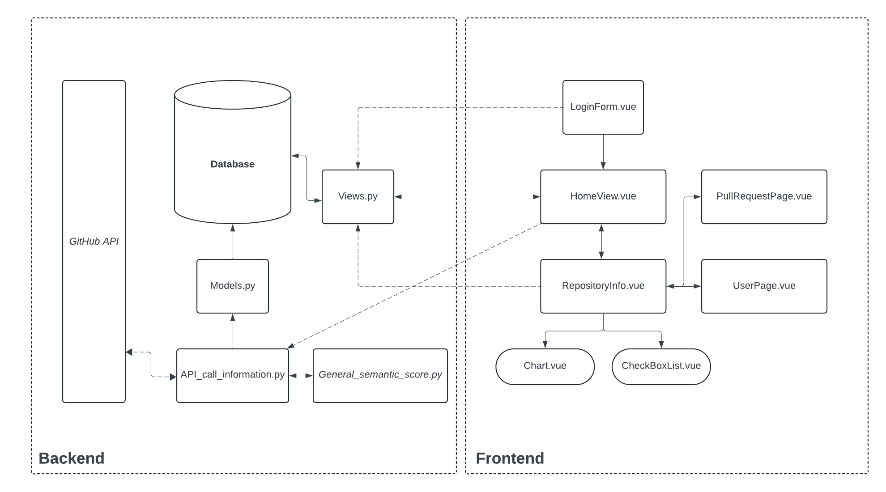
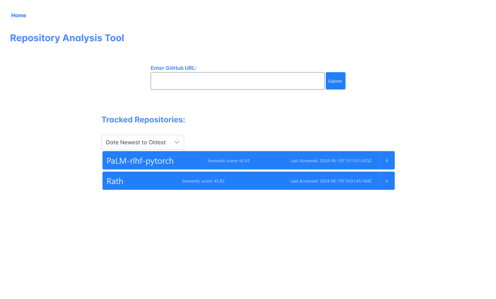
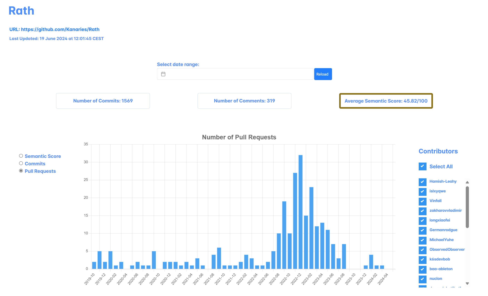
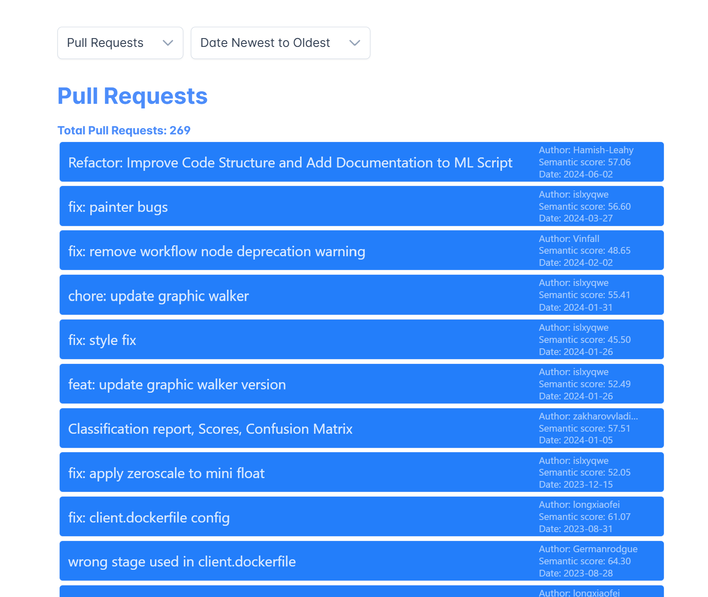
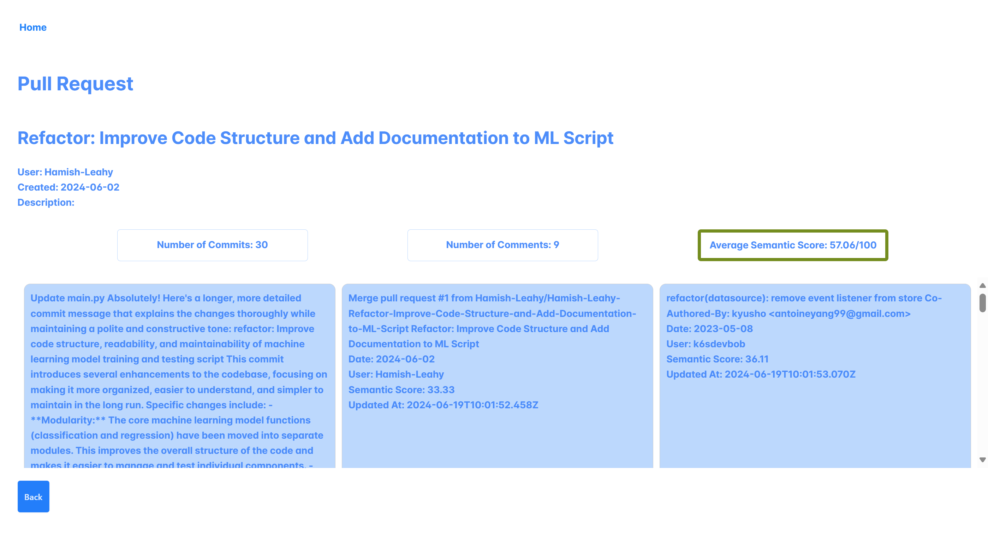

# Github Repository Analysis Tool

This is a project for the course 'Modern Software Development Techniques' at Radboud University.

It is a web app for viewing engagement levels within repositories on GitHub. It can help with management of personnel, such as seeing how well a team is engaging in a software project and give some indication of the quality of work.

It utilizes the GitHub API, Django, and Vue.js.



This README contains basic installation and usage instructions. For more detailed information, please refer to the documentation in the /docs folder.

## Installation

The GitHub API requires a personal access token ('classic', not 'fine-grained'). This can be generated in the developer settings of your GitHub account. This token should be stored in a .env file in /backend/api_project. The .env file should look like this:

```
GITHUB_PERSONAL_ACCESS_TOKEN="your_token_here"
```

All Python dependencies are outlined in the requirements.txt file. The following NLTK dependencies may also be required:

nltk.download('punkt')
nltk.download('averaged_perceptron_tagger')

The Vue app requires Node.js and npm.

## Usage

### Running the Django app

```
  cd backend
  cd api_project
  python manage.py runserver
```

### Running the Vue app

```
  cd frontend
  npm run dev
```

## Common issues

### Login form

This web app uses a login form to authenticate users. To utilize this feature, you need to create a superuser. This can be done by running the following command:

```
  cd backend
  cd api_project
  python manage.py createsuperuser
```

### Graph Features

There are a couple unintuitive features in the web app that are worth mentioning. Firstly, the bars (or points) that appear on the graph are clickable. By default, each bar represents a single month, and clicking on a bar will display daily data for that entire month. Secondly, the "Contributors" checkbox list on the right of the graph also filters the pull requests that are displayed at the bottom of the main Repository page.

## Authors

This project was created by the following students at Radboud University:

Eloy Wijlhuizen, Marie Oldeman, Eduardo Calvo, Lasse Kuipers, Daniel Danilin, Thijs Berende, Teun de Waal, and Maurits van ‘t Hag.

## Sample Screenshots






## License

This project is licensed under the BSD 3-Clause License - see the LICENSE.md file for details.
